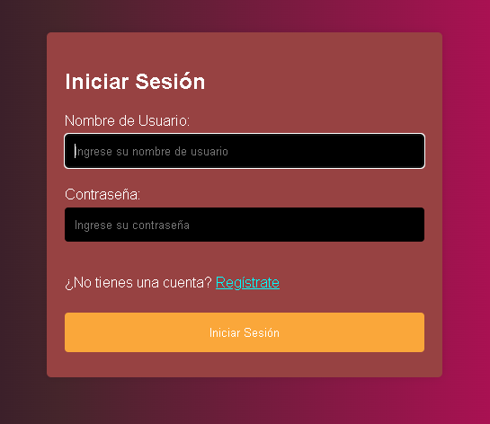
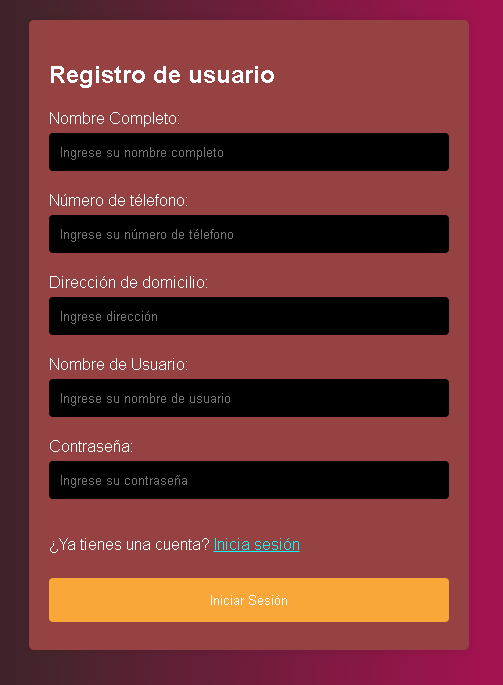
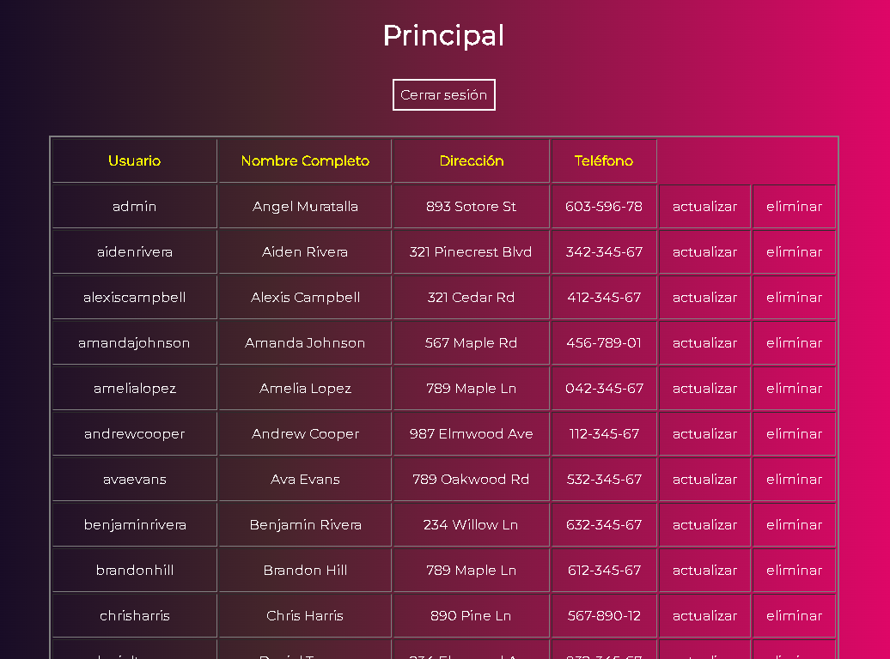
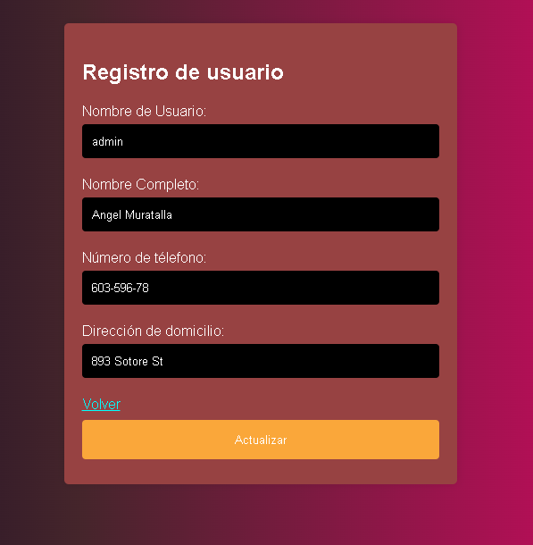

# CRUD PHP

Visita el siguiente enlace para probarlo: http://crud-php.infinityfreeapp.com/

## Inicio de sesión

## Registro de nuevo usuario

## Registros dentro de la base

## Modificación a registro

